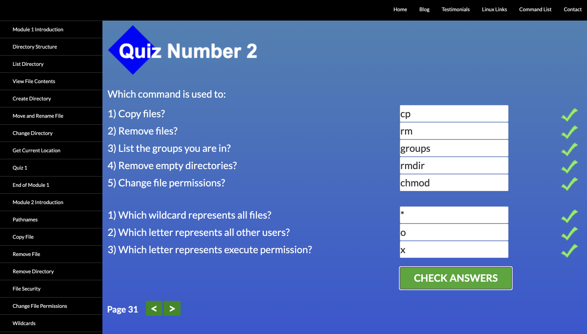
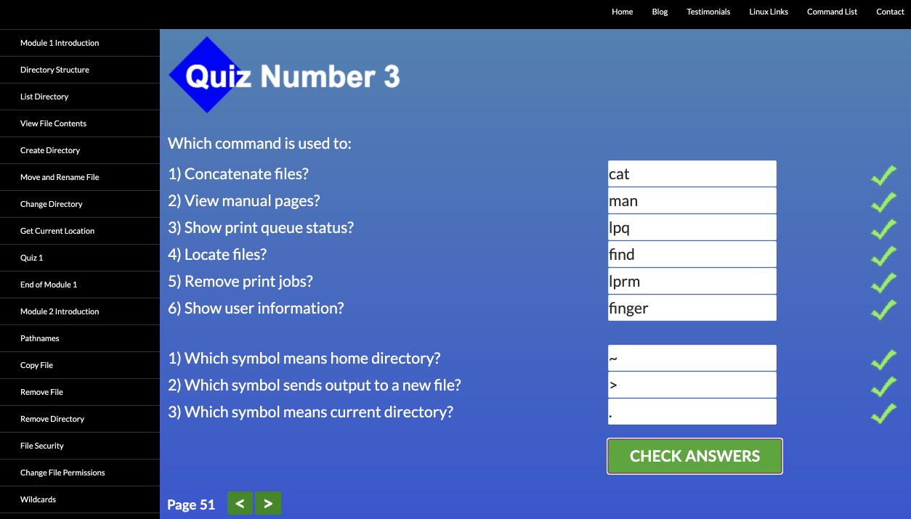
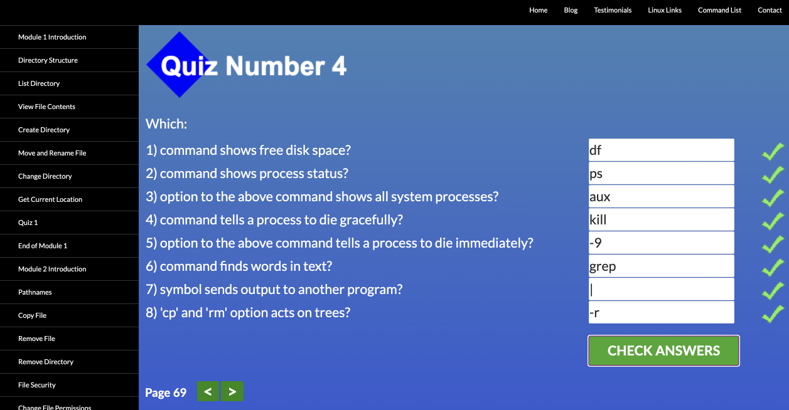

* [Git and GitHub](#git-and-github)
* [Linux CLI and HTTP](#linux-cli-and-http)

# Git and GitHub

I've had some general idea about Git and basic concepts like commits, branches, merging and pull requests as I've had experience working in a development team as a tester. However how it all is done in practice seemed like rocket science to me (especially "scary" rebasing, cherry-picks and resolving merge conflicts). Now I see it is absolutely not :).  
Pretty much everything in courses was __new to me__:  

- making changes to commits with `git revert` and `git reset`
- working with remote repo with `git push`, `git fetch` and `git pull`
- juggling branches with `git rebase`, `git merge`, `git cherry-pick` etc.

 __What surprised me__ is how flexible Git is, as there is always a way to fix a mistake and it's quite hard to make a fatal one.

 
Screenshots:
  
 
 ### Version Control with Git at [udacity](https://www.udacity.com/course/version-control-with-git--ud123)
 

 ### Learn Git Branching at [learngitbranching](https://learngitbranching.js.org/)
 
 
 

# Linux CLI and HTTP

 
Screenshots:
 
 
 |  |  |
 | --- | --- |
 |  |  |
 

